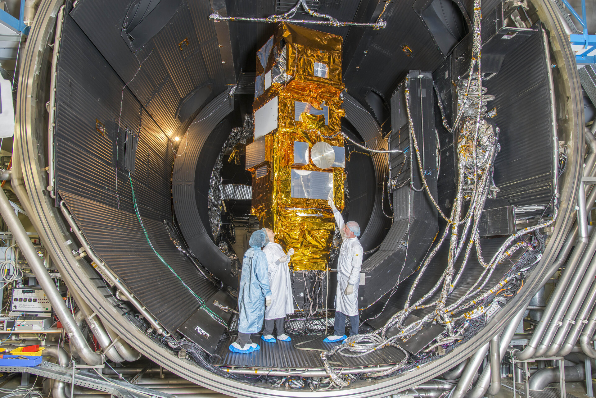
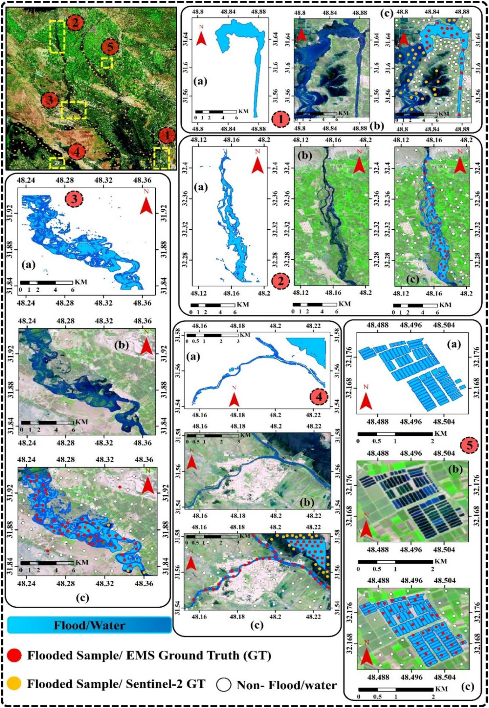

# Summary: What is Sentinel-2?

.pull-left[

### Overview

- Part of the Copernicus Earth observation programme (ESA)

- Multispectral land monitoring mission  

- Constellation: Sentinel-2A and Sentinel-2B  

]

.pull-right[

### Launch dates

- Sentinel-2A — 23 June 2015  

- Sentinel-2B — 7 March 2017  

- Sentinel-2C — 5 September 2024  

 

                                      (Source: ESA)

]
---

# Summary: Key characteristics

.pull-left[
- Equipped with a Multispectral Instrument (MSI), combining a 290 km swath width with 13 spectral bands  

- Bands cover the visible, near-infrared (NIR), and shortwave infrared (SWIR) regions  

- 4 bands at 10 m resolution, 6 bands at 20 m, and 3 bands at 60 m  

- Relatively short revisit time  

- Calibration system with Spectralon diffuser  

- ~1 TB data per day  
                                 (Source:EPA)
]

.pull-right[

Interior photo of the “Sentinel-2” (Source:EPA)
]

---

# Summary: Applications & Importance 

.pull-left[
### Main applications

- **Agriculture & forestry**  
  Monitoring vegetation and crop health  

- **Land cover mapping**  
  Detecting urban expansion and land use change  

- **Ecosystems**  
  Tracking deforestation and biodiversity  

- **Water & environment**  
  Detecting pollution and algal blooms  

- **Disaster mapping**  
  Floods, landslides, volcanic events  
]

.pull-right[
### Why this sensor matters

- Widely available and easy to access  

- Strong analytical capability  

- Multispectral bands enable detailed observation  

- Suitable for research and policy use  
]
---

# Application: Vegetation monitoring

- Used for vegetation condition studies, agricultural monitoring, and ecosystem change analysis

- Red-edge and near-infrared bands widely used for assessing plant health and biomass

- NDVI and similar indices derived from Sentinel-2 data used to evaluate vegetation stress, seasonal variation, and estimate chlorophyll content and moisture, supporting irrigation optimisation

- Sentinel-2 enables detailed monitoring of land cover and land use, including crops, forests, urban areas, and water resources

 (Phiri et al.,2020)

---

# Application: Flood and water mapping

.pull-left[
- Used for mapping water bodies and flood extent, with Sentinel-2 data enabling more accurate identification of water and inundated areas

- Significant technical advances in water indices, clustering, classification, and sub-pixel analysis

- Near-infrared and shortwave infrared bands help distinguish water from surrounding land surfaces

- Applicable to flood management and monitoring of reservoirs, lakes, wetlands, and rivers

 (Farhadi et al.,2025)
]

.pull-right[

Flood/Water Mapping Samples  
*(Farhadi et al., 2025)*
]

---

# Application: Urban and land-cover studies

### Main uses

- Used for urban expansion studies, land cover classification, and urban green space analysis  

- Data used to identify built-up areas, vegetation cover, and broader spatial patterns of environmental change  

- Aimed at supporting sustainable planning, urban monitoring, and environmental assessment  

### Key limitation

- Although Sentinel-2 cannot capture very fine urban detail, its 10 m spatial resolution remains highly useful for medium-scale urban analysis  

### Reference

Kumari and Karthikeyan (2023)

---

# Reflection: Advantages & Limitations

.pull-left[
### Advantages

- Provides free and open-access data,  
  enabling widespread use in research and practical applications  

- Multispectral bands combined with relatively high revisit frequency  
  make it particularly suitable for monitoring changes in vegetation,  
  water bodies, and land surface conditions over time  

- Achieves a strong balance between analytical capability and accessibility,  
  supporting both academic research and applied work  
]

.pull-right[
### Limitations

- Spatial resolution is not sufficiently fine to capture heterogeneous  
  urban landscapes or enable very detailed feature-level analysis  
  in complex urban areas, and may not fully represent spectral variability  
  of urban surface materials, increasing the likelihood of misclassification(Xu et al.,2022)  

- As an optical sensor, Sentinel-2 is affected by cloud cover,  
  which can reduce data availability and limit observations  
  in certain regions or seasons  
]

---

# Reflection: what this sensor highlights

- After examining the advantages and limitations of Sentinel-2,  
  I realised that no sensor can be considered universally  
  “best” in all contexts  

- The value of a sensor depends on how well its characteristics  
  align with the research objectives  

- Sentinel-2 appears particularly useful when the aim is to monitor  
  large-scale environmental patterns rather than very fine detail  

- This has helped me develop a more critical perspective on remote sensing,  
  as it is not only about what data are available,  
  but also about what those data can and cannot reveal  

- Overall, this task has encouraged me to think more carefully  
  about the relationship between sensor design, research objectives,  
  and analytical outcomes  

---

# 10. Reference

- ESA (2026) Instrument. [Online].Available from: https://www.esa.int/Applications/Observing_the_Earth/Copernicus/Sentinel-2/Instrument [Accessed: 24 January 2026]. 
- ESA (2026) Introducing Sentinel-2. [Online].Available from: https://www.esa.int/Applications/Observing_the_Earth/Copernicus/Sentinel-2/Introducing_Sentinel-2#:~:text=Satellite%20images%20can%20be%20used,2B%20on%207%20March%202017. [Accessed: 24 January 2026]. 
- ESA (2026) Satellite constellation. [Online].Available from: https://www.esa.int/Applications/Observing_the_Earth/Copernicus/Sentinel-2/Satellite_constellation [Accessed: 24 January 2026]. 
- ESA (2026) Sentinel-2 Colour vision for Copernicus. [Online].Available from: https://www.esa.int/Applications/Observing_the_Earth/Copernicus/Sentinel-2 [Accessed: 24 January 2026]. 
- Farhadi, H., Ebadi, H., Kiani, A. and Asgary, A., (2025). Introducing a new index for flood mapping using Sentinel-2 imagery (SFMI). Computers & Geosciences, 194, p.105742.
- Kumari, A. and Karthikeyan, S., (2023). Sentinel-2 data for land use/land cover mapping: A meta-analysis and review. SN Computer Science, 4(6), p.815.
- Phiri, D., Simwanda, M., Salekin, S., Nyirenda, V.R., Murayama, Y. and Ranagalage, M., (2020). Sentinel-2 data for land cover/use mapping: A review. Remote sensing, 12(14), p.2291.
- Xu, F., Heremans, S. and Somers, B., (2022). Urban land cover mapping with Sentinel-2: A spectro-spatio-temporal analysis. Urban Informatics, 1(1), p.8.

