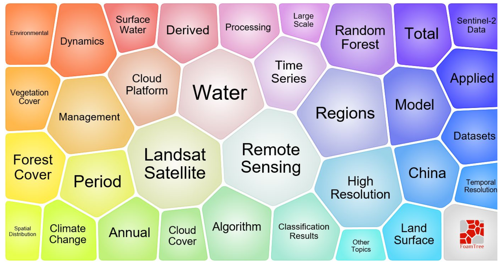
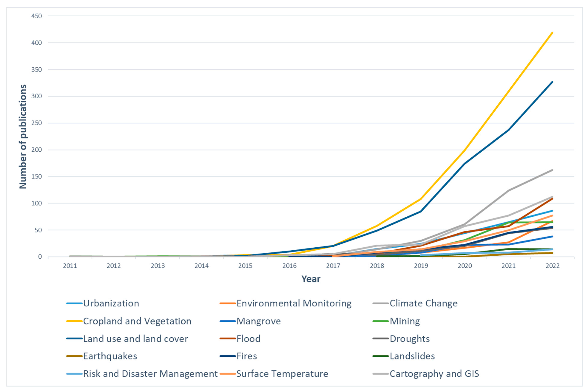

# Week 5 Google Earth Engine

## Summary

### Google Earth Engine

- Google Earth Engine (GEE) is a cloud-based platform for geospatial processing and remote sensing analysis.
- It allows users to access and analyse large Earth observation datasets without handling all data locally.
- It is especially valuable for remote sensing because many studies rely on large image archives, repeated processing and multi-temporal comparison.
- This means that GEE is not only a data platform, but also an analytical environment.

### Image collection

- An image collection is a group of related satellite images stored together as a dataset.
- Instead of treating one image as the whole study material, remote sensing often works with many scenes collected across time or space.
- This is important because environmental analysis usually depends on comparing, combining or selecting from multiple images rather than relying on a single scene.

### Composite image

- A composite image is a new image produced by combining multiple scenes into one output.
- Methods such as mean, median and mosaic create different types of composites.
- The purpose of a composite is to reduce noise, improve consistency and create a more useful representation of the study area.

### Texture analysis

- Texture analysis examines the spatial arrangement and variation of pixel values, rather than focusing only on their individual spectral values.
- It is useful because surfaces with similar reflectance can still differ in roughness, heterogeneity or spatial pattern.
- Texture can reveal additional information that ordinary band values may miss.
- Texture analysis extends remote sensing beyond simple colour or brightness differences.

### PCA

- Principal Component Analysis (PCA) is a dimensionality reduction technique that transforms correlated spectral bands into a smaller number of new variables called principal components.
- These components summarise the main patterns of variation in the image.
- The first components usually capture most of the information, while later components contain less variation or more noise.
- PCA is important because it simplifies complex multispectral data and can make major spectral contrasts easier to detect and interpret.

### NDVI

- NDVI, or the Normalised Difference Vegetation Index, is a vegetation index calculated from the red and near-infrared bands.
- It is based on the idea that healthy vegetation absorbs red light for photosynthesis but reflects near-infrared strongly.
- Higher NDVI values generally indicate denser or healthier vegetation, while lower values are associated with bare ground, built surfaces or water.
- It turns raw spectral data into a more interpretable environmental indicator.

## Application

Google Earth Engine (GEE) has particular value for long-term monitoring, large-scale mapping, and operational decision support, as it integrates multi-source datasets, ready-to-use algorithms, and export functions within a single platform. Its development has made the processing of global and regional time-series imagery considerably more efficient than traditional desktop-based workflows. In particular, Landsat, as one of the most widely used datasets, has been applied across a broad range of fields, from forest and vegetation studies to medical research, including applications related to malaria (Kumar and Mutanga, 2018; Zhao et al., 2021).

{width="70%"}

##3 vegetation and ecosystem monitoring

Mutanga and Kumar (2019) review several applications in which GEE has been used to estimate biodiversity-related variables, such as leaf area index, fraction of absorbed photosynthetically active radiation, vegetation cover, and canopy water content, as well as to monitor vegetation dynamics over time. They also highlight practical examples, including the use of MODIS-derived Enhanced Vegetation Index (EVI) for vegetation monitoring in Vietnam, multi-season Landsat composites for land cover and vegetation mapping in a nature reserve in China, and long-term mapping of pasture dynamics in Brazil between 2000 and 2016.

### land use and land cover mapping.

Previous studies have used it to generate dynamic land cover maps of Beijing and to reconstruct more than three decades of land use and land cover change across Brazilian biomes (Lee et al., 2018; Tsai et al., 2018). In addition, large volumes of surface temperature data have been successfully extracted using thousands of Landsat images over extended time periods, demonstrating GEE’s capacity to process and analyse large-scale, long-term datasets (Ravanelli et al., 2018; Velastegui-Montoya et al., 2023).

{width="70%"}

### agriculture and disaster management.

Studies have applied it to cropland mapping in the United States and across Africa, mapping of smallholder farming systems, crop yield estimation, flood monitoring and emergency response, flood inundation mapping, and the analysis of global soil moisture datasets (Aguilar et al., 2018; He et al., 2018). These examples indicate that GEE functions not only as a research tool, but also as a platform capable of supporting real-world monitoring and early warning systems.

## Reflection

This week marked my first substantial engagement with Google Earth Engine (GEE), and it was the first time that remote sensing felt more tangible in practice. My experience with GEE coding has been mixed. At the outset, it felt unfamiliar and somewhat challenging, as its syntax and logic differ from both Python and R, requiring a degree of adjustment. However, once I began working through the workflow, it became more intuitive and, at times, quite engaging. From defining a study area and filtering imagery to generating outputs and exporting results, the process can be carried out in a relatively continuous and coherent manner. This made it easier to see how different stages of a remote sensing analysis are connected. That said, my familiarity with the code remains limited, and even minor errors can still be difficult to troubleshoot with confidence.

The practical exercises also highlighted that each step in the workflow serves a clear purpose. Filtering imagery by date, location, and cloud cover is not merely a technical step, but one that directly influences the quality of the final outputs. Similarly, processes such as scaling, compositing, and clipping are integral to ensuring meaningful results. Initially, I approached these steps in a procedural way, following instructions without fully understanding their significance. However, through repeated practice, I began to develop a clearer sense of what each step achieves and why it is necessary.

At the same time, it became evident that GEE does not inherently simplify remote sensing analysis. While it streamlines data processing and centralises workflows, it does not eliminate the need for critical thinking. Decisions regarding how to structure the workflow, which methods to apply, and how to interpret the outputs still require careful consideration. Without a clear understanding of the analytical choices being made, the resulting outputs may not meaningfully support the intended analysis.

Finally, the case studies presented in the literature reinforced the breadth of applications supported by GEE. The same platform can be applied to vegetation monitoring, land cover change analysis, agricultural assessment, and flood mapping, with different datasets, indices, and methods selected according to the research objective. This highlighted that the skills developed this week extend beyond a single exercise and are likely to be relevant for future coursework and research.

