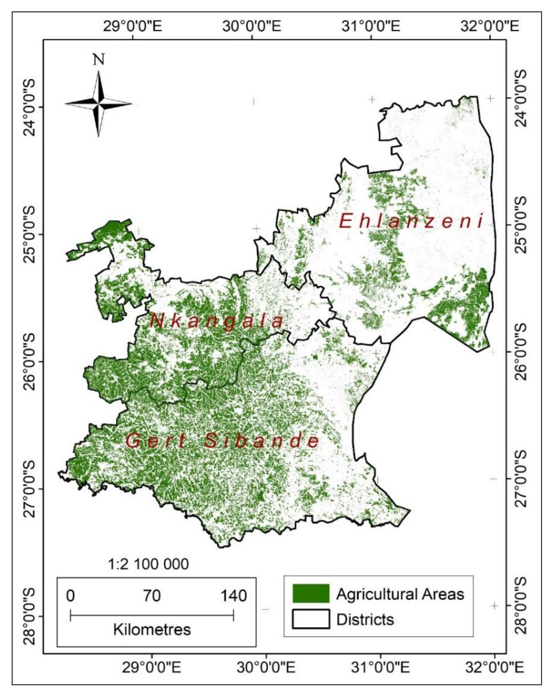
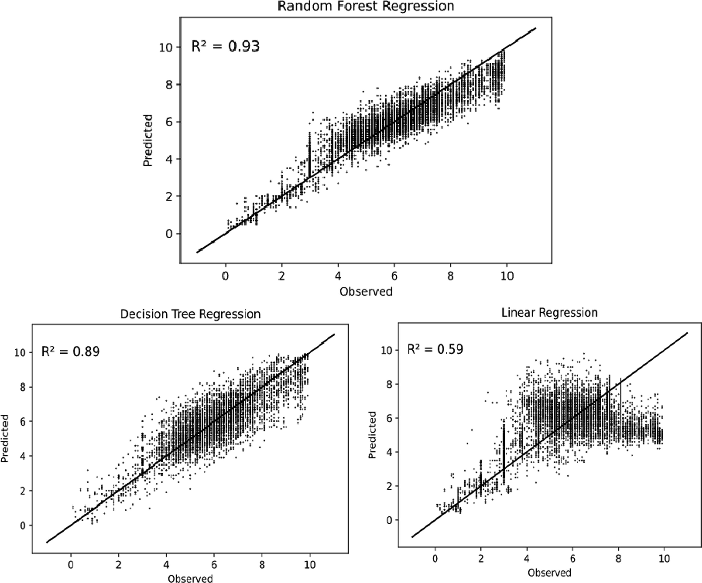

# Week 6 Classification 1

## Summary

### What is image classification

-   The process of assigning pixels in remote sensing imagery to different categories according to their spectral characteristics.
-   These categories can represent different land cover types, such as water, urban, grass, bare earth, and forest.
-   Transforming continuous spectral information into thematic information that is easier to interpret and apply.

### Classification approaches

#### Unsupervised classification

-   It does not require pre-labelled samples.
-   It mainly clusters pixels according to the spectral structure of the image itself.
-   Common methods include k-means and ISODATA.
-   Its advantage is that it relies less on prior knowledge.
-   Its disadvantage is that the results are often difficult to interpret and usually require the researcher - to assign class names afterwards.

#### Supervised classification

-   It requires manually provided training data.
-   It uses known class samples to train a model and then applies that model to the entire image.
-   In the practical, the main methods used were CART and Random Forest.
-   GEE also supports supervised classifiers such as Naive Bayes and SVM

### Understanding feature vectors

-   Classification is fundamentally based on feature vectors.
-   Each pixel was represented by a set of band values, such as B2, B3, B4, B5, B6, and B7.
-   These band values together constitute the input features for the classifier.
-   The class label indicates the land cover category to which the pixel belongs.

### Basic principles of CART

-   CART is a decision tree classifier.
-   It works by repeatedly splitting the data so that the categories within each node become more homogeneous.
-   In classification problems, the splitting criterion is usually related to gini impurity.
-   Its advantages are that the logic is intuitive and relatively easy to understand.
-   Its disadvantage is that a single tree can be strongly influenced by sample selection, and the results may be relatively noisy.

### Basic principles of Random Forest

-   Random Forest is an ensemble method composed of many decision trees.
-   It generates multiple trees by repeatedly sampling the training data, and then combines the predictions from all trees to produce the final result.
-   Compared with a single CART model, Random Forest is generally more stable, and its classification results are often smoother and more reliable.

### Overfitting

-   Overfitting refers to a situation in which a model performs very well on the training data but performs poorly on new unseen data.
-   For decision trees, if splitting continues indefinitely, the tree becomes overly complex and may effectively “memorise” the training samples rather than learn patterns that can be generalised.

## Application

Magidi et al.(2021) primarily employ Random Forest as a classification tool to map the distribution of irrigated areas in Mpumalanga Province, South Africa. However, their analysis does not stop at producing a simple land cover map. Instead, they first classify cropland in relation to other land use types and then use dry-season NDVI values to distinguish between irrigated and rainfed agriculture. The district-level irrigation map shown in Figure 1 reflects a policy-oriented application of Random Forest, with outputs intended to support agricultural water management, irrigation planning, and food security in this water-scarce region. Their approach also relies heavily on expert knowledge, very high-resolution reference imagery, and existing land use datasets, indicating that the accuracy of Random Forest depends not only on the algorithm itself but also on the quality of the supporting data used for training and validation.

{width="70%"}

In contrast, Pande et al.(2024) apply Random Forest to multi-temporal land use and land cover (LULC) change mapping rather than irrigation detection. Their study primarily focuses on comparing RF-50 and RF-100 tree models within GEE for the years 2014 and 2020, placing greater emphasis on model configuration and classification performance. The results indicate that increasing the number of trees can, in some cases, improve robustness, but also show that very high training accuracy does not necessarily translate into equally strong validation performance, particularly where classes such as bare land and built-up areas share similar spectral characteristics. This highlights certain limitations: although Random Forest can produce visually convincing maps, it remains difficult to clearly distinguish between mixed classes or those with similar spectral signatures.

Choudhary et al.(2022) extend this approach further by demonstrating that Random Forest is not limited to classification, but can also be applied as a regression model. Their workflow first uses a Random Forest classifier to identify cropland and rice-growing areas, and then integrates environmental, soil, and topographic variables to predict rice yield using Sentinel-2 imagery. Figure 2 is particularly important: the comparison between observed and predicted values shows that Random Forest regression outperforms decision tree regression and linear regression, with R² values of 0.93, 0.89, and 0.59, respectively. Methodologically, this differs from the other two studies, as the objective is no longer to assign discrete land cover classes, but to estimate a continuous variable.

{width="70%"}

## Reflection

Methods such as Random Forest appear highly powerful: they can be used for land cover classification, change detection, and even crop yield prediction. However, both the literature and practical applications suggest that implementing these methods in real policy or management contexts is not straightforward. The challenge lies not only in selecting an appropriate model, but in constructing a complete workflow around it. Their effectiveness depends on the quality of training data, appropriate feature selection, rigorous validation, and, critically, a workflow designed around the research question rather than the model itself. This involves acquiring suitable remote sensing imagery, preparing training data, handling cloud contamination, selecting variables, validating outputs, and communicating results in a form that can be meaningfully used by non-specialists. The difficulty therefore lies not in the algorithm itself, but in the substantial effort, expert judgement, and technical infrastructure required to produce reliable results.

This has led me to reflect on the extent to which Random Forest remains dependent on the quality of supporting data. Initially, I assumed that as long as the code was implemented correctly, machine learning could largely resolve classification problems, with the main difficulty lying in algorithm construction. However, the case studies this week clearly demonstrate that this is not the case. Training samples still need to be representative, classes must be carefully defined, and where spectral characteristics overlap, certain land cover types remain difficult to distinguish. As a result, the method appears less like a “black box” solution and more like a structured approach to dealing with uncertainty.
