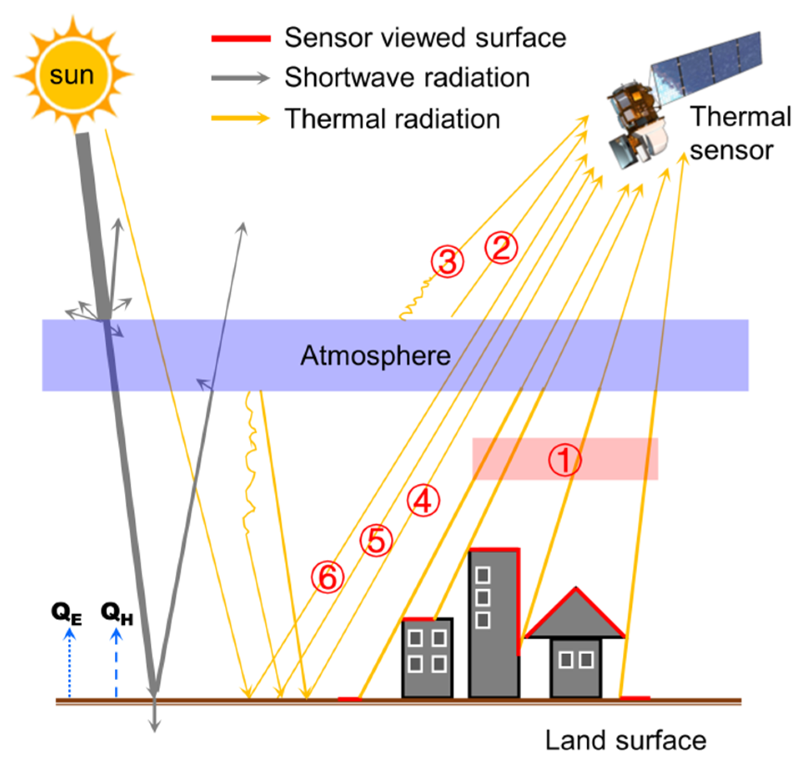
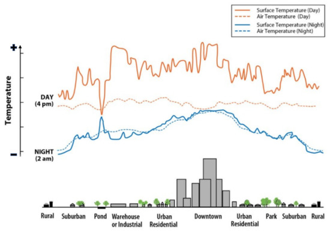

# Week 8 - Temperature

## Summary

### UHI

- The urban heat island (UHI) effect refers to the phenomenon whereby atmospheric and surface temperatures in urban areas are often higher than those in surrounding rural areas. 

- This is primarily driven by two factors:

  - a greater presence of dark, heat-retaining surfaces
  - reduced vegetation, which decreases evapotranspiration and limits shading effects
  
- However, the causes are more complex than this, and also include low sky view factor (SVF), building materials, anthropogenic heat sources, wind speed, and cloud cover. 
- Taken together, these factors indicate that UHI is shaped by the interaction between land cover, urban morphology, and urban processes, rather than being determined by any single factor.

### Importance of UHI

- From a social perspective, rising temperatures are closely associated with heat-related illness and mortality.
- From an environmental perspective, increasing temperatures lead to higher cooling demand, greater electricity consumption, and increased fossil fuel use, thereby intensifying greenhouse gas emissions and environmental pollution.
- From an economic perspective, the impacts are also significant. The costs of UHI may affect healthcare, transport, and energy systems. This implies that UHI should not be considered merely as a localised temperature anomaly, but as a broader urban governance issue with social, environmental, and economic consequences.

### Relationship between policy and remote sensing

- The lecture compared policies across different scales, noting that:

  - global and national policies tend to be broad and aspirational
  - metropolitan and local policies are typically more detailed and implementation-oriented
  
- Even so, due to funding constraints, political factors, local priorities, and the uneven distribution of benefits, practical interventions are often difficult to fully implement.

Remote sensing can support the detection, monitoring, and mapping of patterns associated with UHI, including land surface temperature, land cover, albedo, and vegetation distribution. This gives it value not only in describing the heat island effect, but also in informing potential interventions. At the same time, the lecture cautioned against treating data as a complete solution. It highlighted the gap between policy and data analysis, and emphasised that analytical outputs must be practical, closely linked to planning questions, and attentive to issues of inequality, equity, and environmental justice.

## Application

Remote sensing is particularly useful for studying the urban heat island effect because it enables the spatial analysis of temperature, rather than relying solely on point-based meteorological station data. Land surface temperature (LST) is one of the most commonly used variables in the study of surface urban heat islands (SUHI), with thermal sensors from Landsat, MODIS, and ASTER providing the most widely used data sources (Almeida et al., 2021; Zhou et al., 2019). These datasets not only allow the identification of urban heat hotspots, but also support comparisons of thermal patterns across different land cover types, seasons, and times of day, while linking temperature variations to urban characteristics such as vegetation, impervious surfaces, and albedo.

{width="70%"}

Figure 1 is particularly informative, as it demonstrates that LST is not a direct measurement of ground temperature. Thermal sensors record surface radiance, and the signal received by the sensor is influenced by atmospheric conditions. Emissivity correction is therefore required before LST can be derived (Almeida et al., 2021). In other words, satellite-derived temperature products are processed and interpreted outputs, rather than direct representations of “real-world” temperature. While remotely sensed temperature can support planning decisions, it must be interpreted with caution, particularly where cloud cover, spatial scale, and retrieval uncertainties affect data quality.

{width="70%"}

Figure 2 highlights a further important point: land surface temperature and air temperature exhibit different patterns across urban space and between day and night. The figure shows that variations in LST across different land use types are more pronounced than those observed in air temperature. This suggests that high-temperature surfaces such as roofs, roads, or industrial areas do not necessarily correspond to equivalent thermal conditions at street level. This is consistent with recent reviews, which caution against treating satellite-derived LST as a direct proxy for human heat exposure or pedestrian thermal comfort (Diem et al., 2024; Almeida et al., 2021).

Overall, the application of remote sensing to urban heat island studies extends beyond simply mapping areas of high temperature. By integrating LST with land cover, vegetation, and urban form data, it supports the development of more targeted mitigation strategies. For example, it can help identify areas where greening interventions, reflective materials, or redesign of building surfaces may be most needed. 

## Reflection

The urban heat island effect appears to be a phenomenon that, once established, becomes highly visible yet difficult to reverse in practice. It does not arise from a single major planning failure, but rather from the cumulative impact of many small and seemingly ordinary decisions: the use of dark materials, the reduction of vegetation, the expansion of impervious surfaces, increasing building density, and development choices that may appear insignificant in isolation. This makes the problem particularly challenging to address, as its drivers are incremental, dispersed, and often embedded within routine urban development. In this sense, the urban heat island is not only an environmental condition, but also the outcome of long-term patterns of construction and urban management.

Remote sensing therefore holds significant research value, even though it is neither straightforward to apply nor capable of providing immediate solutions. It enables the visualisation of spatial patterns at a scale that is difficult to capture through other means. It can reveal areas where heat accumulates, illustrate their relationship with land cover and urban form, and in some cases support modelling to explore how interventions, such as greening or surface modification, may alter these patterns. For the urban heat island effect, these capabilities are particularly important, as without spatial evidence it is often difficult to recognise the cumulative impact of incremental decisions.

However, the use of remotely sensed temperature data requires a cautious approach. Land surface temperature is not equivalent to air temperature, and neither fully represents the thermal conditions experienced by individuals in everyday situations, such as walking at street level, waiting for transport, or living in poorly ventilated environments. Although heat maps may appear objective and persuasive, they do not automatically translate into a comprehensive understanding of vulnerability. The value of remote sensing lies not in providing definitive answers, but in making the urban heat island effect more visible and interpretable, thereby supporting more informed decision-making. The more difficult question is whether cities, in political and practical terms, are willing to act on this evidence in ways that are both effective and equitable, which ultimately remains a key factor in addressing the problem.
